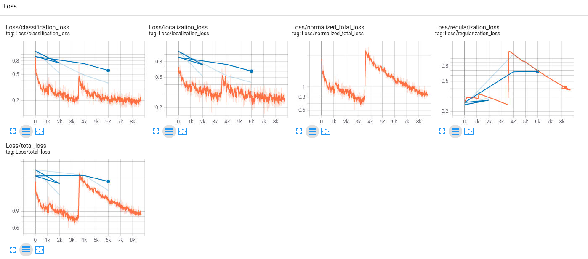
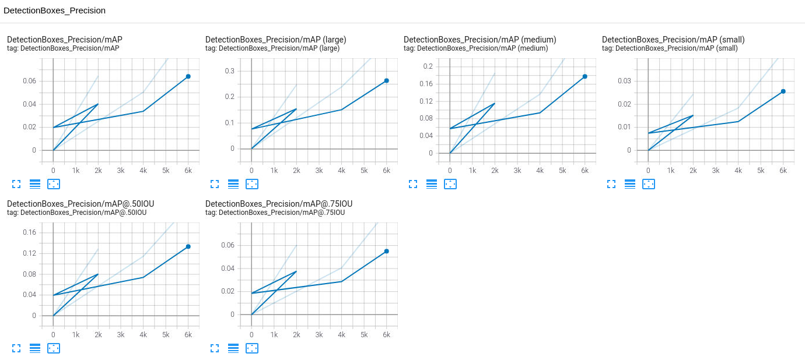
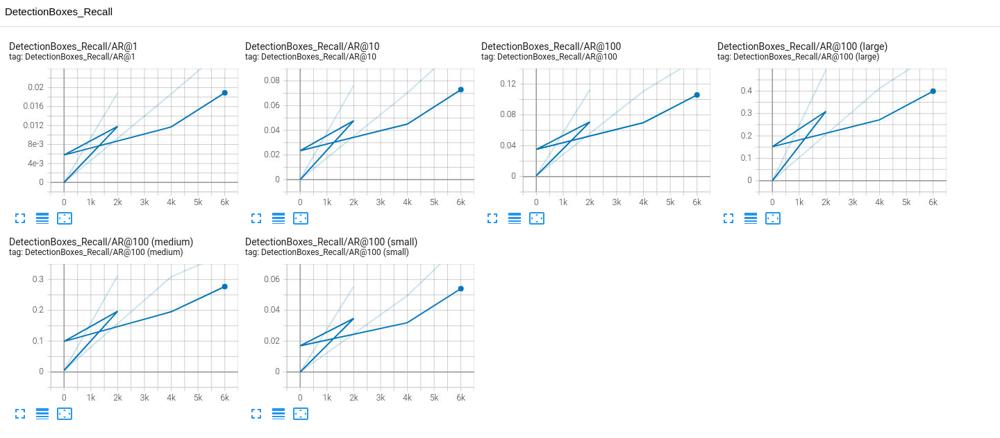
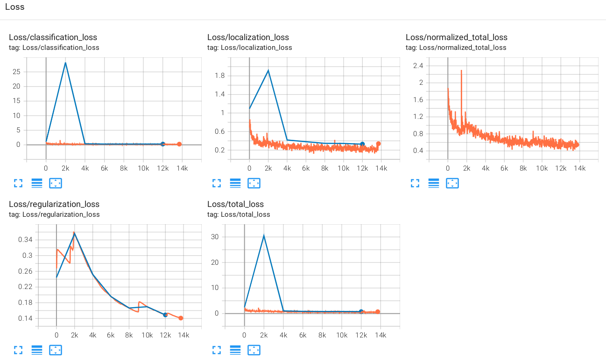
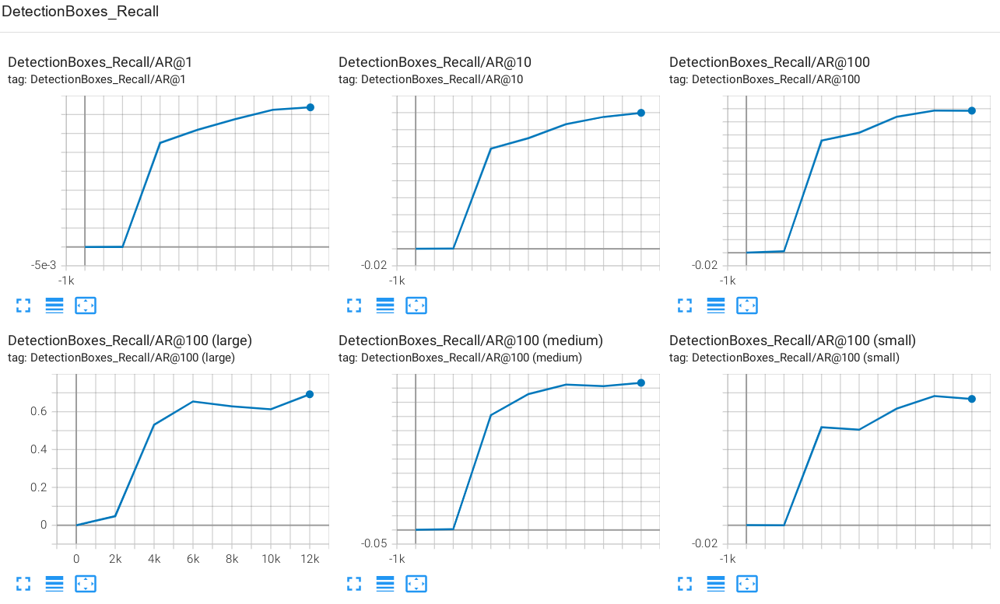
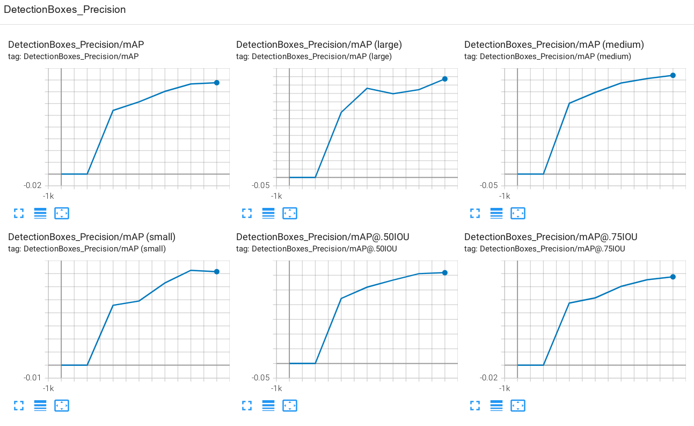
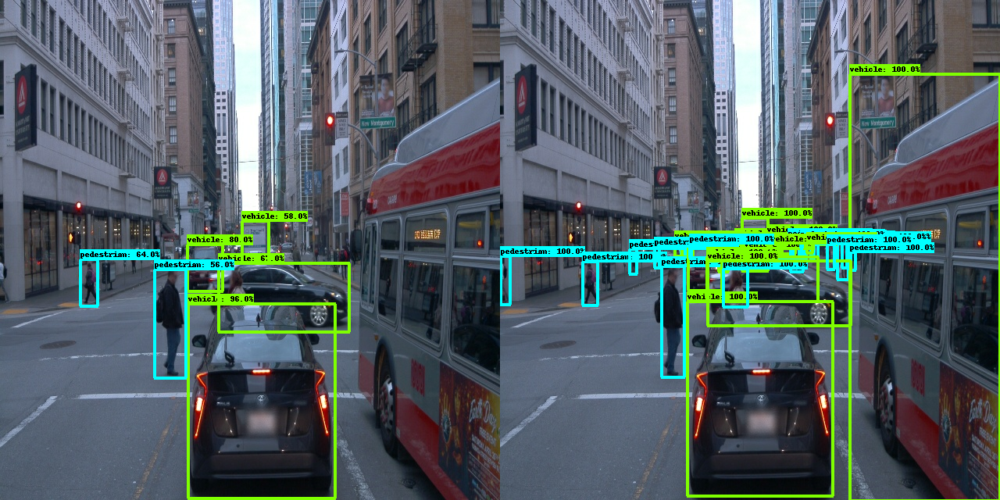

### Project overview
This project is about object detection and classification in urban environment. Objects that detected and classified in this project are cars, pedestrians and cyclists. Note, there are many more object classes a self driving car would need to detect, for example traffic lights, traffic signs, emergency vehicles etc.

Object detection is a very important component of a self driving cars, it is its eyes. It is crucial to understand what other traffic actors are around a self driving car to begin reason about how to act.

### Set up
I was working on the project on my machine. For that I needed to imporove provided [build/Dockerfile](build/Dockerfile). To build container, please follow steps provided in the [build/README](build/README.md).

Once development locally was finished, I uploaded my code to my Udacity workspace and trained the model.

### Dataset
#### Dataset analysis
I have decided to use all availabla examples. There are 798 TFRecords that comprise 15947 examples. An example in TensorFlow lingo is an image together with labels, bounding boxes data etc.

Here are some examples from the dataset:


We notice there are day time and night time images. Let us find out if the dataset is balanced in that regard. For that we represent each image by a single value, its avarage grayscale value. For dark images such a value will be lower, then for bright ones. Here is a histogram over all images in the dataset:


Clearly, there are two peaks. One for night time images and one for day time images. The dataset has many more day time images, it is **not balanced** in this regard.

Let us pick a threshold for a night time or a daytime image at a value of 0.25 and plot some images of each class.

Night time images:


Day time images:


For the classification task it is important that objects of each class are well represented in the dataset. During EDA it was found that cyclists are underrepresented. Number of pedestrians is also low.

Here is a histogram over the number of objects per class:


Finally we checked how many objects are there in image. Here is the histogram:


We do not notice any irregularities in the data. Images with 10 to 20 objects are the most common ones.

Please referer to [Exploratory Data Analysis Notebook](Exploratory%20Data%20Analysis.ipynb) for details on how the analysis was performed.

#### Cross validation
After the EDA the dataset was split in three parts. Training - 80% of the dataset, validation - 10%, test - 10%.

The split itself was perfomed by the [script](create_splits.py). Great care was taken for images with cyclist. Because there are so few cyclists, we made sure they are equally pressent in all parts of the split.

### Training
#### Reference experiment
Here are TensorBoard plols that demonstrate training process for the reference experiment.

Loss plots of the training:


Orange curve is the loss on train set where as blue curve is the loss on the eval set.

**Please note:** For some reason evaluation was computed twice for the first checkpoint - this is the reason why blue curve has such a shape.

In general the loss curves are as expected. We see that the loss on the training set is smaller then on eval set. That is because the model performs better on the data it was optimized for.

**Please note:** The training ended abruptly after 8k steps. I decided not to repeat it and continue directly with the next experiment.

Here are also experiments of precision and recall.

Precision:


Recall:


#### Improve on the reference
To improve the results of the reference experiment we analyzed three possible augmentations:
 - Random Adjust Brightness
 - Adjust Gamma
 - Random Adjust Contrast.

 Here are some processed images. We will plot them in four columns. First column will be original image and next three - augmentations.
 

We can clearly see that random nature of adjusting brightness (second column) is not optimal. Some images are made darker. Gamma adjustment makes images always brighter. Contrast adjustment does not necessarily makes images brighter but it does make them clearer. That is why for augmentation we pick: Gamma Adjustment and Random Contrast Adjustment.

Please referer to [Explore augmentations Notebook](Explore%20augmentations.ipynb) for details on how the analysis was performed.

The following was added to the `pipeline.config` of a reference experiment:
```json
  data_augmentation_options {
    random_adjust_contrast {
      min_delta: 1.2
      max_delta: 1.5
    }
  }
  data_augmentation_options {
    adjust_gamma {
      gamma: 0.7
      gain: 1.0
    }
  }  
```

And here are plots from TensorBoard with training results.

Loss:

Few things to note here. There was a blip in eval (blue) curves around 2k steps. I suspect this is due to the syncronization issues between training and evaluation runs. Other than that, eval losses do show slightly worse results but they are very close to the training losses. This is big improvement comparing to the first experiment.

**Please note:** The Udacity Workspace was again shutdown unexpectedly so the training could perform only 14k steps instead of planned 25k. As I did not have any GPU hours left I decided to submit results as is.

Recall:


Precision


We again note, that recall and precision plots show a great improvement comparing with reference experiment.

Here is a example of model performance.
