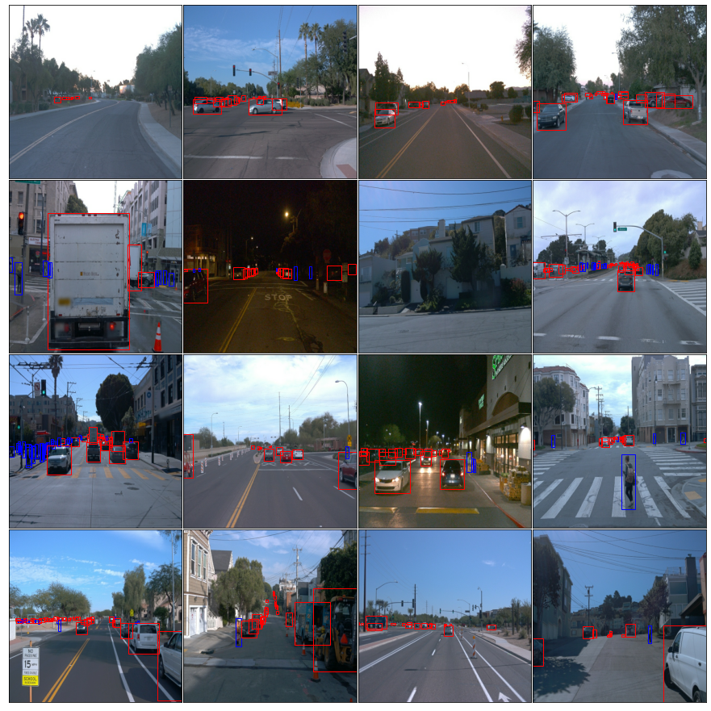
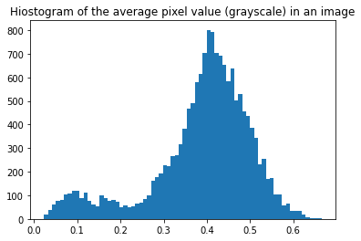
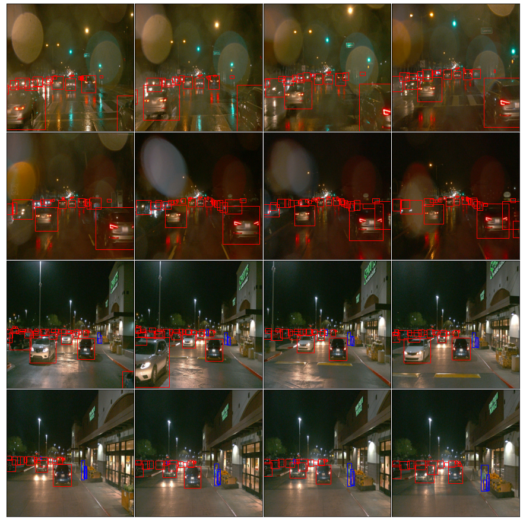
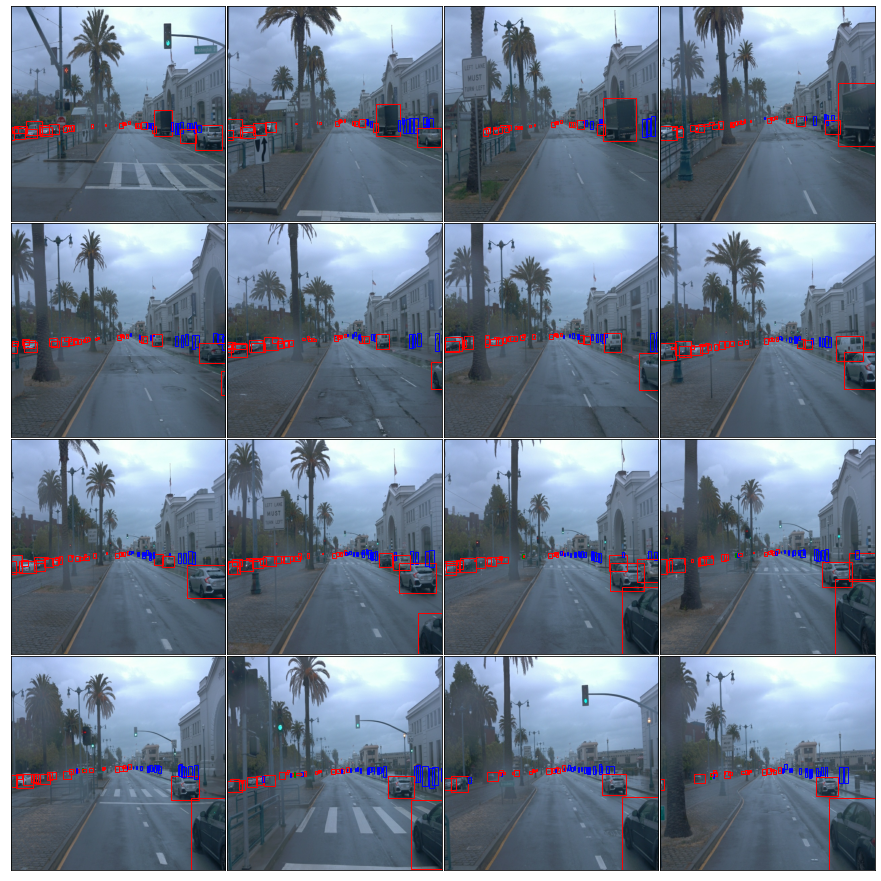
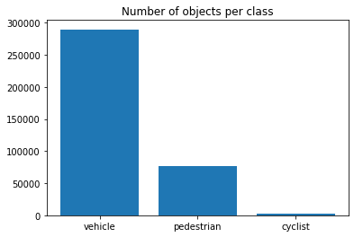
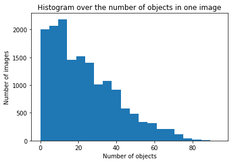
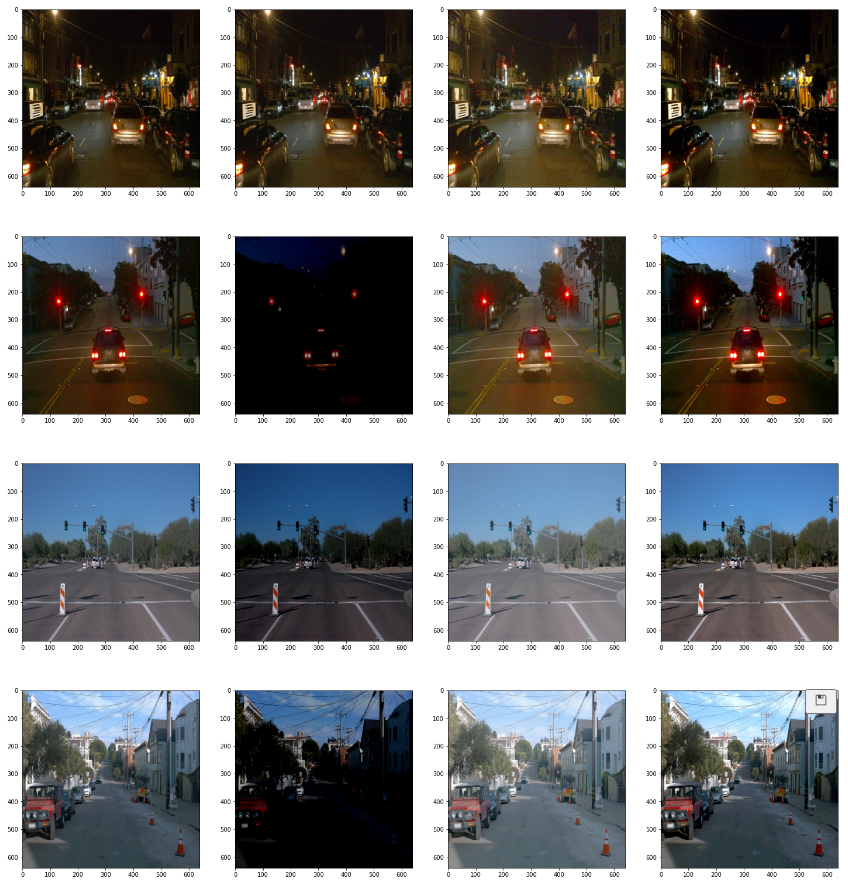

### Project overview
This project is about object detection and classification in urban environment. Objects that detected and classified in this project are cars, pedestrians and cyclists. Note, there are many more object classes a self driving car would need to detect, for example traffic lights, traffic signs, emergency vehicles etc.

Object detection is a very important component of a self driving cars, it is its eyes. It is crucial to understand what other traffic actors are around a self driving car to begin reason about how to act.

### Set up
I was working on the project on my machine. For that I needed to imporove provided [build/Dockerfile](build/Dockerfile). To build container, please follow steps provided in the [build/README](build/README.md).

Once development locally was finished, I uploaded my code to my Udacity workspace and trained the model.

### Dataset
#### Dataset analysis
I have decided to use all availabla examples. There are 798 TFRecords that comprise 15947 examples. An example in TensorFlow lingo is an image together with labels, bounding boxes data etc.

Here are some examples from the dataset:

We notice there are day time and night time images. Let us find out if the dataset is balanced in that regard. For that we represent each image by a single value, its avarage grayscale value. For dark images such a value will be lower, then for bright ones. Here is a histogram over all images in the dataset:

Clearly, there are two peaks. One for night time images and one for day time images. The dataset has many more day time images, it is **not balanced** in this regard.

Let us pick a threshold for a night time or a daytime image at a value of 0.25 and plot some images of each class.

Night time images:

Day time images:

For the classification task it is important that objects of each class are well represented in the dataset. During EDA it was found that cyclists are underrepresented. Number of pedestrians is also low.

Here is a histogram over the number of objects per class:

Finally we checked how many objects are there in image. Here is the histogram:

We do not notice any irregularities in the data. Images with 10 to 20 objects are the most common ones.

Please referer to [Exploratory Data Analysis Notebook](Exploratory%20Data%20Analysis.ipynb) for details on how the analysis was performed.

#### Cross validation
After the EDA the dataset was split in three parts. Training - 80% of the dataset, validation - 10%, test - 10%.

The split itself was perfomed by the [script](create_splits.py). Great care was taken for images with cyclist. Because there are so few cyclists, we made sure they are equally pressent in all parts of the split.

### Training
#### Reference experiment
This section should detail the results of the reference experiment. It should includes training metrics and a detailed explanation of the algorithm's performances.

#### Improve on the reference
To improve the results of the reference experiment we analyzed three possible augmentations:
 - Random Adjust Brightness
 - Adjust Gamma
 - Random Adjust Contrast.

 Here are some processed images. We will plot them in four columns. First column will be original image and next three - augmentations.
 

We can clearly see that random nature of adjusting brightness (second column) is not optimal. Some images are made darker. Gamma adjustment makes images always brighter. Contrast adjustment does not necessarily makes images brighter but it does make them clearer. That is why for augmentation we pick: Gamma Adjustment and Random Contrast Adjustment.

Please referer to [Explore augmentations Notebook](Explore%20augmentations.ipynb) for details on how the analysis was performed.